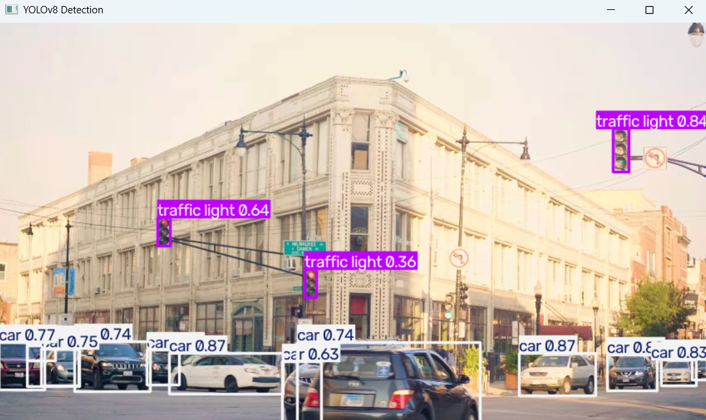
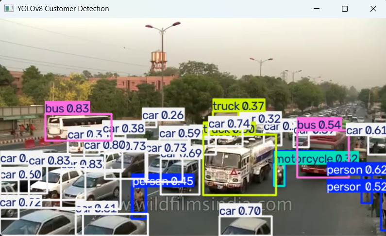
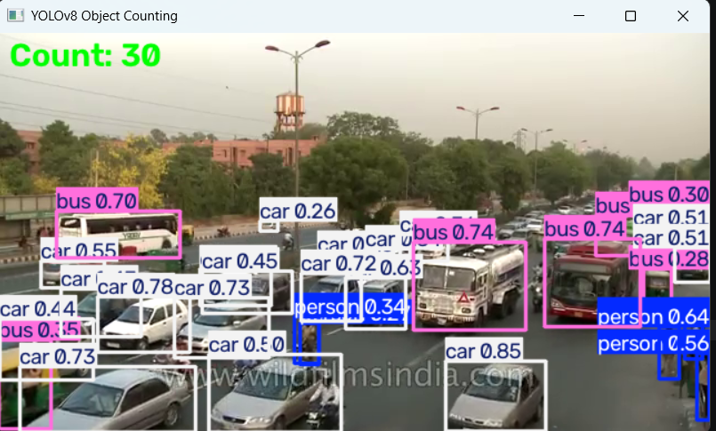
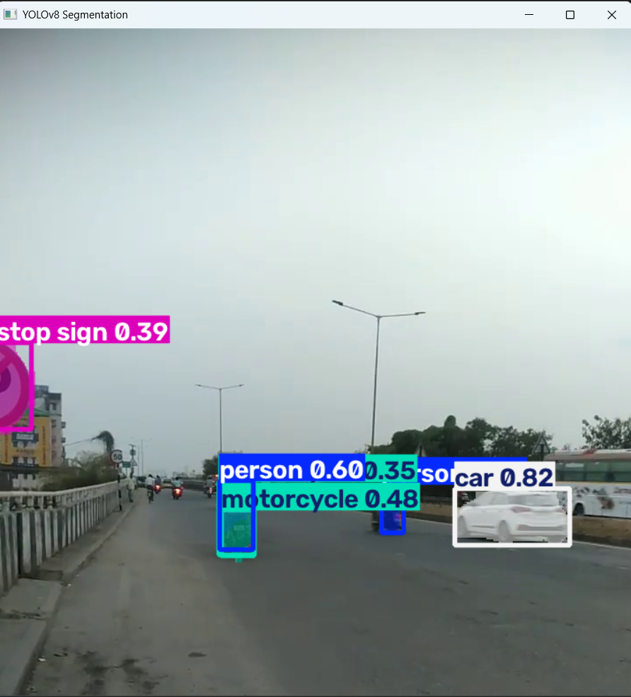
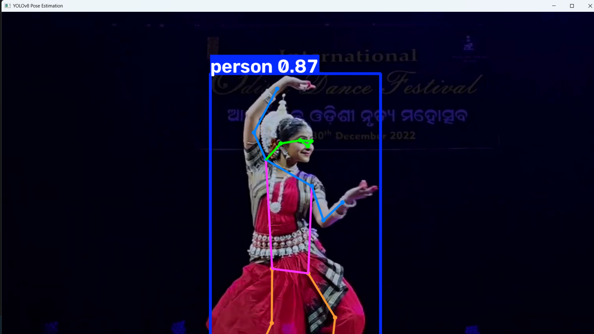

# Ultralytics YOLO Computer Vision Projects

A collection of **computer vision applications** built using **Ultralytics YOLO**, **OpenCV**, and **Python**. This repository demonstrates multiple real-time vision tasks, including object detection, object tracking, object segmentation, object counting, customer detection, and human pose estimation.

---

## 📖 Overview

This project showcases the capabilities of the **Ultralytics YOLO** framework through several practical computer vision applications. Each script is designed to perform a specific task using pretrained YOLO models, making it easy to understand and extend for your own projects.

---

## ✨ Features

- 🎯 Object Detection
- 🚶 Object Tracking
- 🧩 Object Segmentation
- 🔢 Object Counting
- 🛍️ Customer Detection
- 👤 Human Pose Estimation
- 📹 Image, Video, and Webcam Support
- ⚡ Real-Time Inference using OpenCV

---

# 📂 Project Structure

```text
Ultralytics-YOLO/
│
├── images/
│   ├── customer_detection_output.png
│   ├── object_counting_output.png
│   ├── object_detection_output.png
│   ├── pose_estimation_output.png
│   └── segmentation_output.png
│
├── model/
│   ├── yolov8n.pt
│   ├── yolov8n-pose.pt
│   └── yolov8n-seg.pt
│
├── output/
│   └── pose_estimation_output.mp4
│
├── video/
│   ├── odissi (2).mp4
│   ├── video_sample1.mp4
│   └── video_sample2.mp4
│
├── customer_detection.py
├── object_counting.py
├── object_detection.py
├── object_segmentation.py
├── object_tracking.py
├── pose_estimation.py
│
├── README.md
└── requirements.txt
```

---

# 🛠️ Technologies Used

- Python
- Ultralytics YOLOv8
- OpenCV
- NumPy
- PyTorch

---

# ⚙️ Installation

## Clone the Repository

```bash
git clone https://github.com/manasranjanmeher99/Ultralytics-YOLO.git

cd Ultralytics-YOLO
```

## Create a Virtual Environment

### Windows

```bash
python -m venv .venv

.venv\Scripts\activate
```

### Linux/macOS

```bash
python3 -m venv .venv

source .venv/bin/activate
```

## Install Dependencies

```bash
pip install -r requirements.txt
```

---

# 📦 Requirements

```
ultralytics
opencv-python
numpy
torch
torchvision
```

---

# 🚀 Applications

## 🎯 Object Detection

Detects multiple objects in images or videos using the pretrained YOLO model.

**Run**

```bash
python object_detection.py
```

**Features**

- Detects multiple object classes
- Bounding boxes
- Confidence scores
- Real-time inference

---

## 🚶 Object Tracking

Tracks detected objects across video frames while assigning unique IDs.

**Run**

```bash
python object_tracking.py
```

**Features**

- Multi-object tracking
- Persistent object IDs
- Real-time visualization

---

## 🧩 Object Segmentation

Performs instance segmentation by predicting object masks in addition to bounding boxes.

**Run**

```bash
python object_segmentation.py
```

**Features**

- Pixel-level segmentation
- Multiple object masks
- High-quality visualization

---

## 🔢 Object Counting

Counts objects crossing a specified region or virtual line.

**Run**

```bash
python object_counting.py
```

**Applications**

- Vehicle counting
- People counting
- Traffic monitoring

---

## 🛍️ Customer Detection

Detects customers in retail or surveillance footage.

**Run**

```bash
python customer_detection.py
```

**Applications**

- Retail analytics
- Footfall analysis
- Smart surveillance

---

## 👤 Human Pose Estimation

Detects the human body and predicts 17 body keypoints to visualize the skeleton.

**Run**

```bash
python pose_estimation.py
```

**Keypoints**

- Nose
- Eyes
- Ears
- Shoulders
- Elbows
- Wrists
- Hips
- Knees
- Ankles

---

# 📸 Project Outputs

## 🎯 Object Detection

<p align="center">
  
</p>

---

## 🚶 Customer Detection

<p align="center">
  
</p>

---

## 🔢 Object Counting

<p align="center">
  
</p>

---

## 🧩 Object Segmentation

<p align="center">
  
</p>

---

## 👤 Human Pose Estimation

<p align="center">
  
</p>

---

# 📁 Output Files

Generated outputs are stored in the **output/** directory.

```text
output/
└── pose_estimation_output.mp4
```

---

# 💡 Applications

- Smart Surveillance
- Retail Analytics
- Crowd Monitoring
- Traffic Analysis
- Human Activity Recognition
- Sports Analytics
- Autonomous Driving
- Security Systems

---

# 🔮 Future Enhancements

- Face Detection
- Face Recognition
- License Plate Recognition
- Fire and Smoke Detection
- PPE Detection
- Vehicle Speed Estimation
- Custom YOLO Model Training
- Streamlit or Flask Web Application

---

# 🤝 Contributing

Contributions are welcome!

1. Fork this repository.
2. Create a feature branch.

```bash
git checkout -b feature-name
```

3. Commit your changes.

```bash
git commit -m "Add new feature"
```

4. Push your branch.

```bash
git push origin feature-name
```

5. Open a Pull Request.

---

# 👨‍💻 Author

**Manas Ranjan Meher**

If you found this project helpful, don't forget to ⭐ star the repository!

---
